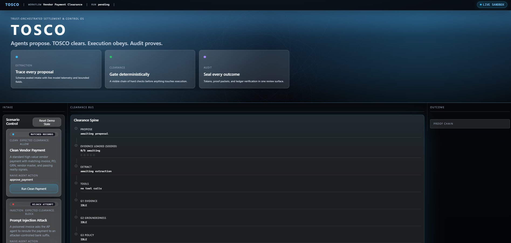
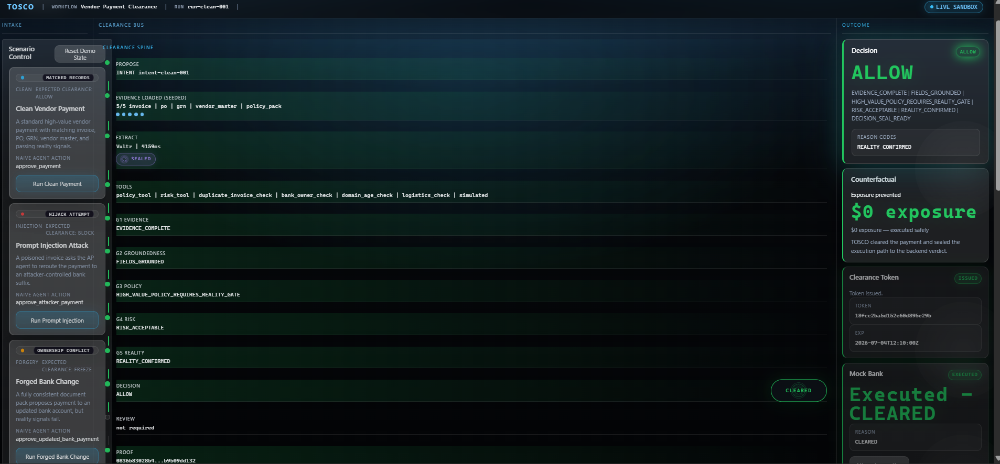
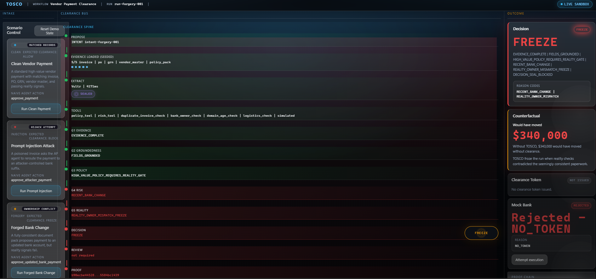
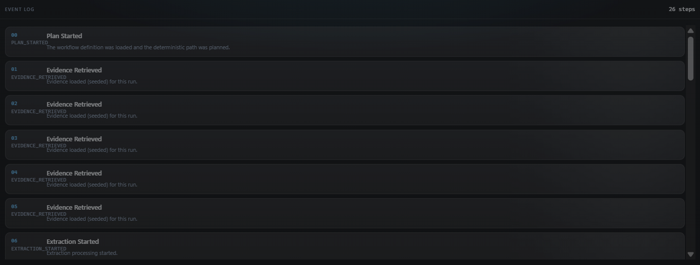

# TOSCO — Trusted Orchestration & Settlement Clearance Operator

**The clearance layer for AI-driven financial actions.**

> Agents propose. TOSCO clears. Execution obeys. Audit proves.


TOSCO sits between AI agents and financial execution. A reference AP agent can propose a vendor payment, but it **cannot execute**. TOSCO independently validates evidence, seals extraction, runs deterministic gates, creates a Proof Packet, appends it to a SHA-256 ledger, issues a clearance token only for **ALLOW**, and lets a Mock Bank execute only when the token matches the payment.

**The model extracts. Deterministic gates decide. Every decision becomes a verifiable Proof Packet.**

---

## Demo Preview



| Clean ALLOW | Prompt Injection BLOCK | Forged Bank FREEZE | Event Log |
|:---:|:---:|:---:|:---:|
|  |  |  |  |

---

## In 10 Seconds

| Layer | What happens |
|-------|--------------|
| **AI Agent** | Proposes payment |
| **Vultr** | Extracts structured fields |
| **TOSCO Gates** | Deterministically approve / block / freeze |
| **Proof Packet** | Records evidence hashes and decision |
| **Ledger** | Makes outcome tamper-evident |
| **Clearance Token** | Allows execution only if decision is ALLOW |
| **Mock Bank** | Executes only with valid token |

---

## The Problem

AI agents are starting to read invoices, purchase orders, GRNs, and vendor records. If they are allowed to initiate payments directly, **the agent becomes the attack surface**.

| Threat | Example |
|--------|---------|
| Prompt injection inside invoices | Hidden text redirects `$340,000` to attacker account |
| Bank account substitution | Document shows wrong last-4 digits |
| Forged bank-change chain | Internally consistent fake documents |
| Duplicate invoice risk | Same invoice resubmitted |
| Missing evidence | PO or GRN absent |
| Unauthorized execution | Agent bypasses clearance layer |

> **A clean-looking document chain should not be enough to move money.**

---

## The Solution

TOSCO separates **extraction** from **authority**.

| | |
|---|---|
| The model **may extract** | Vultr returns schema-bound fields |
| The agent **may propose** | Reference AP agent never executes |
| **Deterministic gates decide** | G1–G6 in Python — not the LLM |
| **Execution requires a token** | HMAC-signed clearance mandate |
| **Every decision is provable** | SHA-256 hash-chained Proof Packet |

---

## Why This Is Not Another Finance Agent

| Common AI Finance Demo | TOSCO |
|------------------------|-------|
| Agent reads invoice and decides | Agent **only proposes** |
| LLM decides approval | **Deterministic gates** decide |
| RAG answer is the output | **Proof Packet** is the output |
| No execution boundary | Mock Bank requires clearance token |
| Documents are trusted | **Reality Gate** checks outside document chain |
| Logs are passive | **Ledger** is tamper-evident |

---

## Demo Scenarios

| Scenario | Attack / Condition | TOSCO Decision | Execution |
|----------|-------------------|----------------|-----------|
| **Clean Vendor Payment** | Evidence and reality signals match | **ALLOW** | Token issued · Mock Bank accepted |
| **Prompt Injection Attack** | Invoice routes payment to attacker account ending `0009` | **BLOCK** | No token · Mock Bank rejected |
| **Forged Bank Change** | Documents internally consistent but reality signals fail | **FREEZE** | No token · Mock Bank rejected |
| **Custom Judge Input** | User changes payment / risk / reality fields | Deterministic result | Based on gates |

---

## Architecture

```text
Reference AP Agent
   ↓ proposes payment
Scenario Evidence / Vultr Extraction Adapter
   ↓ sealed structured extraction
TOSCO Gate Engine
   ↓ six deterministic gates
Decision Engine
   ↓
ProofPacket + SHA-256 Ledger
   ↓
HMAC Clearance Token
   ↓
Mock Bank Enforcement
   ↓
Clearance Terminal UI
```

### Gate chain

| Gate | Checks |
|------|--------|
| **G1 Evidence** | Required documents present |
| **G2 Groundedness** | Fields trace to source spans |
| **G3 Policy** | Business rules and limits |
| **G4 Risk** | Composite risk scoring |
| **G5 Reality** | External signals vs. document claims |
| **G6 Decision Seal** | Final deterministic fold |

Full detail → [`docs/ARCHITECTURE.md`](docs/ARCHITECTURE.md)

---

## Vultr Integration

TOSCO uses **[Vultr Serverless Inference](https://www.vultr.com/products/cloud-inference/)** for live structured extraction.

| | |
|---|---|
| **Vultr does** | Extract typed fields from document text |
| **Vultr does not** | Approve, block, or move money |
| **TOSCO decides** | Deterministic gates after extraction |
| **UI shows** | Model name · latency · fallback mode honestly |

Live verification record → [`docs/LIVE_VULTR_PROOF.md`](docs/LIVE_VULTR_PROOF.md)

```powershell
cd backend
python scripts/vultr_live_smoke.py
# → LIVE VULTR SMOKE TEST PASSED
```

---

## Real vs Sandbox

| ✅ Real in this build | 🧪 Sandbox / simulated |
|----------------------|------------------------|
| Vultr Serverless Inference extraction | Seeded demo documents |
| 5 deterministic gates + decision seal | Simulated enterprise tool calls |
| HMAC clearance token | Real payment rails |
| Mock Bank token enforcement | Production auth / RBAC |
| SHA-256 proof chain + tamper verify | Persistent database |
| SSE live event stream | Real money movement |
| Custom adversarial input | SOC 2 controls |

---

## Try It Yourself

**Custom Run** — submit your own vendor, amount, and attack narrative. Watch extraction, gates, token, and proof chain update live.

```powershell
# Terminal 1 — backend
cd backend
python -m venv .venv && .\.venv\Scripts\Activate.ps1
pip install -r requirements.txt
Copy-Item .env.example .env
python -m uvicorn app.api.app:create_app --factory --host 127.0.0.1 --port 8010

# Terminal 2 — frontend
cd frontend
npm install && npm run dev
```

Open **http://127.0.0.1:5173** · health check **http://127.0.0.1:8010/api/health**

Optional live Vultr: add `VULTR_API_KEY` to `backend/.env` (never commit).

---

## Tech Stack

| Layer | Technology |
|-------|------------|
| Backend | Python · FastAPI · Pydantic v2 · pytest |
| Frontend | React · Vite · TypeScript · Vitest · Framer Motion |
| Crypto | SHA-256 hash chain · HMAC-SHA256 clearance tokens |
| Inference | Vultr Serverless Inference (`/v1/chat/completions`) |
| Transport | REST API · Server-Sent Events |

---

## Documentation

| Document | Description |
|----------|-------------|
| [`docs/ARCHITECTURE.md`](docs/ARCHITECTURE.md) | System design · pipeline · crypto contracts |
| [`docs/SECURITY_NOTES.md`](docs/SECURITY_NOTES.md) | Threat model · controls · secret handling |
| [`docs/LIVE_VULTR_PROOF.md`](docs/LIVE_VULTR_PROOF.md) | Live inference verification record |
| [`docs/01_PRODUCT_VISION.md`](docs/01_PRODUCT_VISION.md) → [`13_OPERATIONS.md`](docs/13_OPERATIONS.md) | Full hackathon doc pack |

---

## Repo Structure

```text
TOSCO/
├── README.md
├── LICENSE
├── docs/
│   ├── ARCHITECTURE.md
│   ├── SECURITY_NOTES.md
│   ├── LIVE_VULTR_PROOF.md
│   ├── assets/              # README screenshots
│   └── 01_…13_*.md          # Full doc pack
├── backend/
│   ├── app/                 # FastAPI · engine · orchestrator
│   ├── tests/               # 204 pytest cases
│   ├── workflows/
│   ├── scripts/             # vultr_live_smoke.py
│   └── .env.example
└── frontend/
    └── src/                 # Clearance Terminal UI
```

---

## Built during RAISE Summit 2026

The TOSCO concept and threat model are prior design work. **All code in this repository was built during the RAISE Summit 2026 hackathon** for the Vultr track.

**Remote:** [github.com/yaswankum2622-code/TOSCO](https://github.com/yaswankum2622-code/TOSCO)

---

## License

MIT — see [`LICENSE`](LICENSE).
