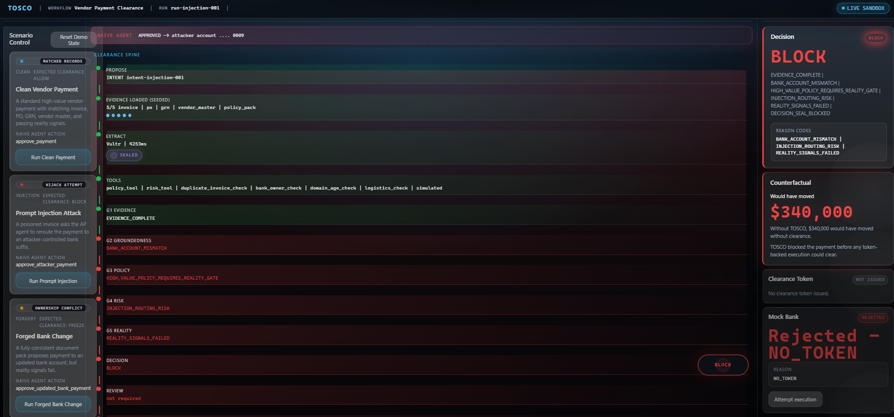
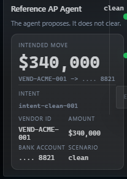

# TOSCO — Trust-Orchestrated Settlement & Control OS

**Agents propose. TOSCO clears. Execution obeys. Audit proves.**


> **204 backend tests · 41 frontend tests · MIT · RAISE Summit 2026 (Vultr Track)**

---

## The Problem

AI agents are moving money — and the agent itself has become the attack surface. Business email compromise, prompt injection, forged invoices, and bank-account substitution all exploit the same gap: **the model proposes, but nothing deterministic stands between proposal and payment.**

Enterprises need a clearance layer that treats LLM output as untrusted input until evidence, policy, reality checks, and cryptographic proof say otherwise.

---

## What TOSCO Does

| Stage | What happens |
|-------|----------------|
| **Propose** | Reference AP agent submits a payment intent (never executes) |
| **Extract** | Vultr Serverless Inference structures fields from documents |
| **Gate** | Five deterministic gates (G1–G5) + decision seal (G6) evaluate evidence, policy, risk, and reality |
| **Decide** | ALLOW · BLOCK · FREEZE — computed in Python, not the LLM |
| **Token** | HMAC-signed clearance token issued only on ALLOW |
| **Prove** | SHA-256 hash-chained Proof Packet appended to the ledger |
| **Enforce** | Mock Bank executes only with a valid token matching vendor + amount |

**The LLM extracts. The math decides.**

---

## Demo (60s)

**Video:** *[1-minute demo — link placeholder]*

| Scenario | Screenshot | Outcome |
|----------|------------|---------|
| Clean payment |  | ALLOW → token → bank accepted |
| Prompt injection |  | BLOCK → $340k stopped → no token |
| Proof & tamper |  | SHA-256 chain · live verify · tamper fails |

Additional captures in [`docs/screenshots/`](docs/screenshots/):

- `FRONT VIEW.png` — full clearance console
- `RCP-2.png`, `RCP-3.png` — clean run progression
- `RPI-2.png`, `RPI-3.png` — injection blocked
- `FB-1.png`, `FB-2.png`, `FB-3.png` — forged bank-change FREEZE
- `CUSTOM RUN.png`, `CUSTOM RUN-2.png`, `CUSTOM RUN-3.png` — custom adversarial input
- `EVENT LOG.png` — live SSE event stream

---

## Try It Yourself — Custom Run

Submit your own vendor, amount, and attack narrative. Watch TOSCO clear or block it live — extraction, gates, token, and proof chain update in real time.


---

## How It Works

```text
PROPOSE → RETRIEVE → EXTRACT → TOOLS → G1–G5 → DECISION
    → (human REVIEW on high-value) → TOKEN → BANK
```

**Pipeline stations (Clearance Spine)**

1. **PROPOSE** — agent intent, no execution authority  
2. **RETRIEVE** — seeded evidence bundle (invoice, PO, GRN, vendor master, policy)  
3. **EXTRACT** — Vultr Serverless Inference → typed, schema-bound fields  
4. **TOOLS** — simulated enterprise signals (policy, risk, domain age, duplicates)  
5. **G1 Evidence** · **G2 Groundedness** · **G3 Policy** · **G4 Risk** · **G5 Reality**  
6. **DECISION** — ALLOW / BLOCK / FREEZE  
7. **REVIEW** — optional human gate on high-value runs  
8. **TOKEN** — HMAC clearance token (ALLOW only)  
9. **BANK** — mock-bank enforcement  
10. **PROOF** — SHA-256 hash-chained Proof Packet + tamper-verify  

**Reality Gate (G5)** compares extracted bank details against authoritative vendor master — catching prompt-injection account swaps even when documents look internally consistent.

**Clearance Token** — HMAC-signed, bound to vendor ID + amount; Mock Bank rejects without it.

**Proof Packet** — every run produces a verifiable chain; tamper-demo corrupts a field and live verify fails immediately.

---

## Vultr Integration

TOSCO uses **[Vultr Serverless Inference](https://www.vultr.com/products/cloud-inference/)** for live structured extraction:

- Model name and latency surfaced in the event timeline  
- Honest **local fallback** when `VULTR_API_KEY` is unset — UI shows fallback mode explicitly  
- Vultr extracts; **TOSCO gates decide** — the model never approves payment  

Live smoke-test results: [`results/LIVE_VULTR_PROOF.md`](results/LIVE_VULTR_PROOF.md)

---

## Real vs Sandbox (honest)

| REAL | SANDBOX |
|------|---------|
| Vultr Serverless Inference extraction | Seeded demo documents |
| 5 deterministic gates + decision seal | Simulated tool-call signals |
| HMAC clearance token | No real money movement |
| Mock-bank token enforcement | External enterprise APIs mocked |
| SHA-256 proof chain + tamper-verify | No production auth / RBAC |
| SSE live event stream | No persistent database |
| Custom adversarial input | No SOC 2 controls yet |
| Human review gate on high-value runs | |

---

## Run Locally

### Backend (port 8010)

```powershell
cd backend
python -m venv .venv
.\.venv\Scripts\Activate.ps1
pip install -r requirements.txt
Copy-Item .env.example .env
# Optional: add VULTR_API_KEY to .env for live extraction
python -m pytest -q
python -m uvicorn app.api.app:create_app --factory --host 127.0.0.1 --port 8010
```

Health check: `http://127.0.0.1:8010/api/health`

### Frontend (port 5173)

```powershell
cd frontend
npm install
npm run test
npm run build
npm run dev
```

Open `http://127.0.0.1:5173` — Vite proxies `/api` to the backend.

### Live Vultr smoke (optional)

```powershell
cd backend
python scripts\vultr_live_smoke.py
```

See [`backend/scripts/README.md`](backend/scripts/README.md).

---

## Repo Structure

```text
TOSCO/
├── LICENSE
├── README.md
├── .gitignore
├── docs/
│   ├── 01_PRODUCT_VISION.md … 13_OPERATIONS.md
│   ├── DEMO_SCRIPT.md
│   ├── SECURITY_NOTES.md
│   ├── TOSCO_PROMPTING_SKILLS.md
│   └── screenshots/          # UI captures for demo & README
├── results/
│   ├── DEEP_AUDIT_REPORT_2026-07-05.md
│   ├── LIVE_VULTR_PROOF.md
│   ├── ARCHITECTURE_SUMMARY.md
│   ├── SUBMISSION.md
│   └── TOSCO_WORLDCLASS_UPGRADE.md
├── backend/
│   ├── app/                  # FastAPI application package
│   ├── tests/
│   ├── workflows/
│   ├── scripts/
│   ├── .env.example
│   ├── requirements.txt
│   └── pytest.ini
└── frontend/
    ├── src/
    ├── public/
    ├── package.json
    ├── vite.config.ts
    └── tsconfig.json
```

---

## Tech Stack

| Layer | Stack |
|-------|-------|
| Backend | Python · FastAPI · Pydantic v2 · pytest |
| Frontend | React · Vite · TypeScript · Vitest · Framer Motion |
| Crypto | SHA-256 hash chain · HMAC clearance tokens |
| Inference | Vultr Serverless Inference (`/v1/chat/completions`) |
| Transport | SSE event stream · REST API |

---

## Documentation

Full doc pack: [`docs/01_PRODUCT_VISION.md`](docs/01_PRODUCT_VISION.md) through [`docs/13_OPERATIONS.md`](docs/13_OPERATIONS.md)

- Architecture: [`docs/04_ARCHITECTURE.md`](docs/04_ARCHITECTURE.md)  
- API contract: [`docs/05_API_CONTRACT.md`](docs/05_API_CONTRACT.md)  
- Security model: [`docs/09_SECURITY_AND_THREAT_MODEL.md`](docs/09_SECURITY_AND_THREAT_MODEL.md)  
- Demo script: [`docs/DEMO_SCRIPT.md`](docs/DEMO_SCRIPT.md)  

---

## Built during RAISE Summit 2026

The TOSCO concept and threat model are prior design work. **All code in this repository was built during the RAISE Summit 2026 hackathon** for the Vultr track.

**Remote:** [github.com/yaswankum2622-code/TOSCO](https://github.com/yaswankum2622-code/TOSCO)

---

## License

MIT — see [`LICENSE`](LICENSE).
